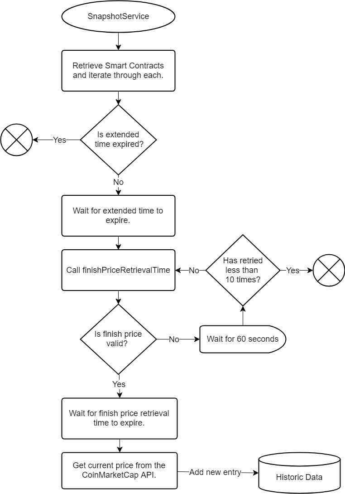

# Cryptoproject

<ul>
    <li>
        <a href="#historic-data">Historic Data</a>
        <ul>
            <li>
                <a href="#snapshot-service">SnapshotService</a>
            </li>
            <li>
                <a href="#historic-data-archiver-service">HistoricDataArchiverService</a>
            </li>
        </ul>
    </li>
    <li>
        <a href="#contact-form">Contact Form</a>
    </li>
    <li>
        <a href="#project-structure">Project Structure</a>
        <ul>
            <li>
                <a href="#components">Components</a>
            </li>
            <li>
                <a href="#services">Services</a>
            </li>
            <li>
                <a href="#redux">Redux</a>
            </li>
            <li>
                <a href="#config">Config</a>
            </li>
            <li>
                <a href="#server">Server</a>
            </li>
            <li>
                <a href="#sass">Sass</a>
            </li>
        </ul>
    </li>
    <li>
        <a href="#styling">Styling</a>
        <ul>
            <li>
                <a href="#useful-styles">Useful styles</a>
            </li>
        </ul>
    </li>
    <li>
        <a href="#launch-phases">Launch Phases</a>
    </li>
    <li>
        <a href="#noteworthy-services-and-components">Noteworthy services and tools</a>
    </li>
</ul>

***

<h2 id="historic-data">Historic Data</h2>

The database has two different historic data tables, one for storing the most recent historic data and one for older historic data. The most recent historic data can be accessed under `/api/historic-data` and the older under `/api/archive/historic-data`.

An example response from making a GET request 
to one of these API’s could look like the 
following:

```javascript
[
    {
        "_id": 0,
        "name": "Crypto 5699",
        "startPrice": 3902,
        "finishPrice": 546,
        "pot": 0.88,
        "nrOfTrades": 176,
        "timestamp": "2018-06-24T17:15:03.295Z"
    }
]
```

The archived historic data can optionally take in two date parameters to get archived historic data between a specific interval. For example `/api/archive/historic-data/20170605-20180505` would return all archived historic data between 2017-06-05 to 2018-05-05. When the user selects two different dates the site uses this call to get the data and then asks the `CsvParser` to create a csv file with it.

<h3 id="snapshot-service">SnapshotService</h3>

This tool waits for the extended time and finish price retrieval time in the smart contracts to expire and then saves data to the historic data table. The service starts along with the server (unless disabled in [site-settings.js](./site-settings.js) and will report which contracts it’s waiting for. Once every hour the service will automatically refresh it’s known smart contracts. More specifically how the algorithm of this service works is illustrated in the flow chart below.



<h3 id="historic-data-archiver-service">HistoricDataArchiverService</h3>

This is a tool to move outdated historic data to the archive. It will similarly to the SnapshotService also start with the server and run in the background if enabled. At the writing moment it will check the recent historic data once a day and move it to the archive if it’s older than 7 days. The archiver can be configured in [site-settings.js](./site-settings.js) and also be triggered manually by running; `node scripts.js archive`

<h2 id="contact-form">Contact Form</h2>

The contact form makes use of the [nodemailer](https://nodemailer.com/about/) which has a smtp connection that can be configured in [site-settings](./site-settings.js). 

To secure against spam the contact form makes use of the Google Recaptcha. The validation of which happens in the sites node.js backend to avoid fabricated POST requests to the `/api/email/` endpoint which is actually used to send the email.

<h2 id="project-structure">Project Structure</h2>

This section explains the basic idea for the structure of this project.

<h3 id="components">Components</h3>

This folder contains all React components in the application. These are then divided into the following sub folders:
1.	**Container:** Components designed to primarily contain other components.
2.	**Modules:** Components designed to work on any site.
3.	**Pages:** Components designed for specific pages in this site.

<h3 id="services">Services</h3>

Contains all utilities which does not fit into the other folders. Basically most files which is not a React Component.

<h3 id="redux">Redux</h3>

Contains all files related to defining redux stores.

<h3 id="config">Config</h3>

Defines all settings which should apply globally to the client side.

<h3 id="server">Server</h3>

Contains all logic for the site’s backend. The directory structure matches the client side for the most part. The difference is the **route** folder which defines the REST API endpoints and the **models** folder which defines the structure for the MongoDB tables.

<h3 id="sass">Sass</h3>

Contains all the styling for the application.

<h2 id="styling">Styling</h2>

The custom styling in the application is wrapped around the [variables.scss](./sass/resources/variables.scss) file. This file defines colors, size of headings, wrappers, media queries and much more. Changing any variablevalue in this file will automatically trigger the site to make changes reflecting it. 

For example changing the **$primary** color value to **#db2828** would make the site look like the following:


Basically any element using the green primary color would turn red instead.

<h3 id="useful-styles">Useful Styles</h3>

Almost every attribute defined in the [variables.scss](./sass/resources/variables.scss) file has an associated style with it. These include:

<ol>
    <li>
        <strong>Colors:</strong> (Sets the color or background color for an element)
        <ul>
            <li><code>.color-(name of any color defined in $colors)</code></li>
            <li><code>.bg-color-(name of any color defined in $colors)	</code></li>
        </ul>
    </li>
    <li>
        <strong>Headings:</strong> (sets different font sizes for an element)
        <ul>
            <li><code>.display-1</code> (largest)</li>
            <li><code>.display-2</code> (smaller)</li>
            <li>…</li>
            <li><code>.display-5</code> (smallest)</li>
            <li><code>.h1</code> (largest) to <code>.h6</code> (smallest)</li>
        </ul>
    </li>
    <li>
        <strong>Wrappers:</strong> (sets a max-width for an element and centers it)
        <ul>
            <li><code>.wrapper-1</code> (largest) to <code>.wrapper-4</code> (smallest)</li>
        </ul>
    </li>
    <li>
        <strong>Dividers</strong> (sets a top and bottom margin for an element):
        <ul>
            <li><code>.divider-1</code> (largest) to <code>.divider-5</code> (smallest)</li>
        </ul>
    </li>
    <li>
        <strong>Padders</strong> (sets padding left and right for an element):
        <ul>
            <li><code>.padder-1</code> (largest) to <code>.padder-5</code> (smallest)</li>
        </ul>
    </li>
</ol>

<h2 id="launch-phases">Launch Phases</h2>

There exists one React Component for each launch phase which are all imported on the [home page](/pages/index.js). To change between the different phases simply swap out the page header component to another phase. For example rendering the PreIcoLaunch looks like the following: 

```typescript jsx
<Page pageClass={stickyOnScroll()} addTimer={true} header={<PreIcoLaunch/>}>
```

To then change into the ICO launch phase the code be changed to:

```typescript jsx
<Page pageClass={stickyOnScroll()} addTimer={true} header={<IcoLaunch/>}>
```

The components for the different phases being:
* `<PreIcoLaunch/>`
* `<IcoLaunch/>`
* `<PostIcoLaunch/>`

<h2 id="noteworthy-services-and-components">Noteworthy services and components</h2>

The following services and components are especially worth looking more into due to their frequency of use in the site.
* [Contract:](./server/services/contract/index.js)
Defines how data from smart contracts should be fetched and transformed.
* [PageTitle:](./components/modules/PageTitle/index.js)
Defines the title for a page with styling matching
the other pages.
* [FullWidthSegment:](./components/containers/FullWidthSegment/index.js)
A customized version of the Semantic UI segment which
spans across the entire width of the screen.
* [AlertOptionPane:](./services/Alert/AlertOptionPane.js)
Is a tool I created in a previous project to 
easily create styled popups. 
[More details.](http://people.cs.umu.se/~c15knn/wiki/index.php?title=Alerts)
* [Dispatcher:](./services/Dispatcher/index.js)
Incapsulates the logic of commonly used methods of updating data in the Redux store.
* [Paths:](./services/Paths/index.js)
Defines the paths to pages as well as static and external resources.
* [Content Settings:](./components/content-settings.js)
Defines the content for the Menus, Footer and FAQ.
