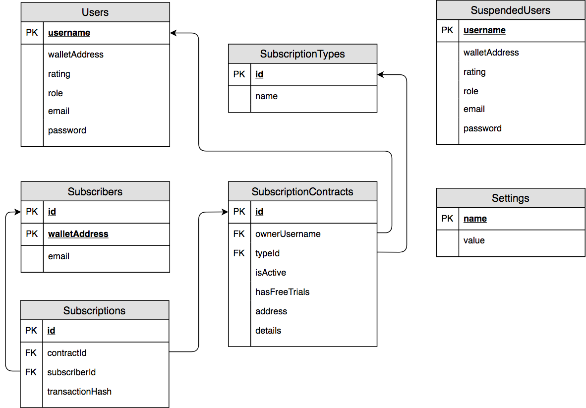

## How to start developing:
1. `npm install`
2. Setup your local MySQL sever to use the user, password and port specified in [serverSettings.js](./server/serverSettings.js).
3. Start the local MySQL server.
4. `npm run dev`
5. The server will then create the whole database schema if it doesn't already exist and load in the [defaultData](server/services/database/defaultData.js) when creating the database for the first time.

## Scripts:
1. `npm run "remove database"`: Removes the database with the name defined in [serverSettings.js](./server/serverSettings.js).
2. `npm run "default database"`: First runs `removeDatabase` then loads all [defaultData](server/services/database/defaultData.js).
3. `npm run "dummy database"`: First runs `removeDatabase` then loads all [dummyData](server/services/database/dummyData.js).
4. `npm run "dump database"`: Creates a dump of the database.
4. `npm run favicon`: Updates the Favicon component to link towards images in the favicon folder.
5. `npm run "create admin"`: Command-line interface for creating a new admin user.
6. `node scripts.js hashPassword string`: Prints out the hashed version of the given string.

## Login:
The site loads in some accounts by default. Check the list of users defined in [defaultData](server/services/database/defaultData.js).

## Project Structure:
- **Root**: Contains files that can be accessed by both the server and client.
- **Client**: Contains all frontend code. Should never import from the server.
    - **Hocs**: Contains all higher-order components.
    - **Containers**: Components designed to primarily contain other components.
    - **Modules**: Components designed to work on any site.
    - **Site-Modules**: Components designed specifically for this site.
    - **Services**: All files which are not a React Component.
- **Server**: Contains all backend code. Should never import from the client.
    - **Config:** Files used for the initial server setup.
    - **Routes:** Defines the REST API.
    - **Models:** Defines all the different database tables.
    - **Services:** Contains other utilities and tools specific to the server.
    
## Database Design:

